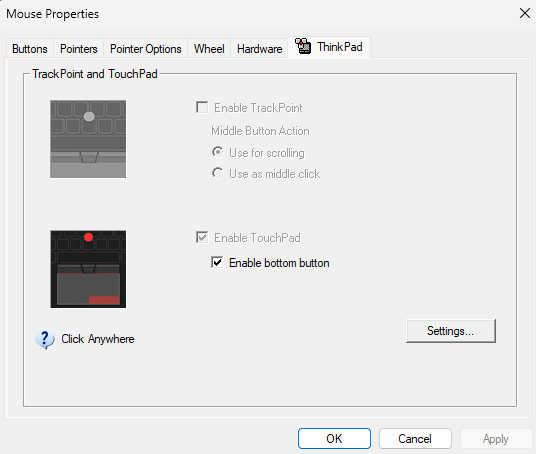
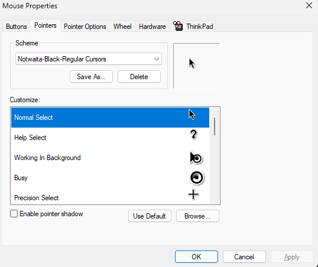

# Dotfiles for Windows

Setup used for windows setup

## 🐁 Mouse Cursor 

Credits to [Adwaita Cursors](https://github.com/ful1e5/notwaita-cursor)

### 🚀 How to install 

* git clone folder and navigate to Notwaita-Regular-Windows directory
* Click the `install.inf`
* On settings navigate to mouse
* Click the additional mouse settings
* Navigate to pointers
  
  

* Select the `Notwaita-Black-Regular-Cursor` 
  
  

* Click apply!

## 🐚 Open shell

Windows 7 vibes OS

* Download open shell
* Edit the `Menu Settings.xml` and point the file location on it
* Open the OpenShell click load xml file
* Save!
* To ensure that will be on startup, on the task manager enable the `StartMenu` in Taskmanager > Startup Apps

## 🧰 Other applications / stuffs

* git bash
* winget
* neofetch
* wintop
* Ntop (HTOP for Windows)
