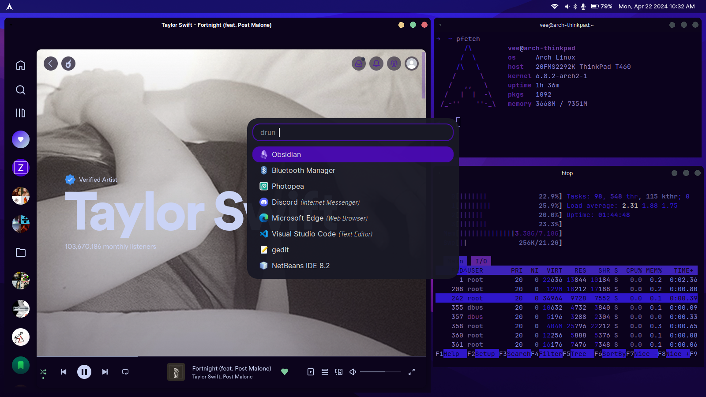

# My dot files

list of my config stuffs on `./config` folder

## Setup

* fontawesome6
* wofi
* waybar
* labwc
* sway (wayland compositor)

## pre-requisuites

* wev (keybinds)
* pavucontrol
* pipewire for bluetooth service
* thunar file manager
* gsettings for gtk stuffs

## desktop setup

* labwc (window manager) 
* theme : yam-onedark (fork of siduck-onedark)
* waybar (bar)
* rofi (app launcher)
* alacritty (terminal)

